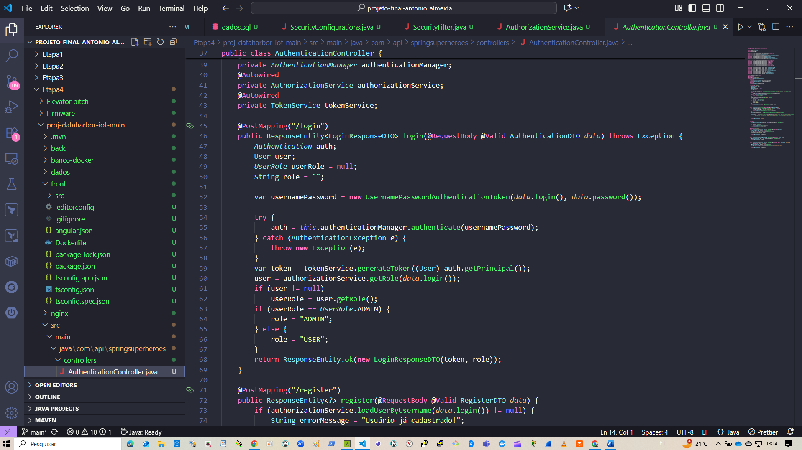
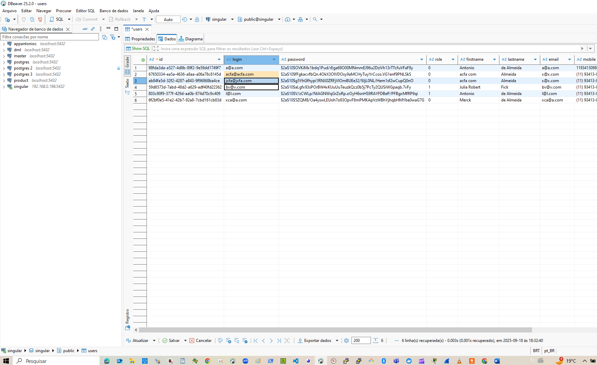

# 🚀 Projeto Final da Fase 2: Etapa 4 – Entrega Final

## ➰ DataHarbor IoT

Este projeto apresenta a espinha dorsal para a construção de uma solução **IoT completa e moderna**, integrando **firmware embarcado, front-end Angular, back-end Spring Boot (Java17) e banco de dados Postgres**, empacotados via **Docker Compose** para execução em ambientes locais ou em nuvem (Cloudflare / AWS).

Permite através do sensor de temperatura da placa Raspberry Pico W, coração da BitDogLab, colher dez amostras da sua temperatura, calculando média aritmética e mostrando no navegador. Também comanda o led contido na mesma placa.
Percebam que o foco principal não é mostrar um hardware sofisticado embasado em técnicas futurísticas de engenharia.
Aqui demonstramos o foco em software moderno, concebido com intuito de integração de tecnologias de naturezas diversas, cada qual, com sua contribuição ao todo, provando como se lê grandezas físicas e provoca atuadores através do celular, tablet ou PC estando em qualquer parte do planeta com conexão de internet.



---

## 📂 Estrutura do Projeto - ETAPA 4 (versão final do projeto testada e aprovada)

O repositório está organizado em três principais pastas:

### 1. 📄 Elevator Pitch

Apresentação executiva do projeto, destacando:

- O **problema** que buscamos resolver.
- A **solução proposta, onde e como podemos atingir** com DataHarbor-IoT.
- Os **benefícios e diferenciais** frente a soluções tradicionais.
- Uma visão rápida e clara para professores e parceiros técnicos.

---

### 2. ⚙️ Firmware

- Firmware embarcado escrito em linguagem 'C', totalmente apoiado no **lwIP** (Lightweight TCP/IP stack):
  - **Descoberta automática de dispositivos** na rede.
  - **CGI (Common Gateway Interface)** para controle remoto.
  - **SSI (Server-Side Includes)** para status dinâmico, bem como integração por pacotes json (json escrito hard-core, sem uso de biblioteca).
  - Endpoints **RESTful** para integração transparente com o back-end.

Esse firmware permite comunicação bidirecional com a aplicação, servindo como **ponte entre o mundo físico (sensores/atuadores)** e a camada de software.

---

### 3. 🐳 proj-dataharbor-iot-main

## Docker & Aplicação Web

Ambiente completo em containers, pronto para subir via **Docker Compose**:

- **Front-end (Angular 17)**

  - Interface rica e responsiva.
  - Gerenciamento de estado com **NgRx Store**.
  - Tela de **login** e **cadastro de usuários**.
  - Consumo direto das APIs do back-end.

- **Back-end (Java Spring Boot 17 LTS)**

  - APIs **RESTful** para autenticação e recursos IoT.
  - Segurança baseada em **JWT (JSON Web Token)**.
  - Integração direta com o banco Postgres.

- **Banco de Dados (Postgres 15)**

  - Banco relacional robusto.
  - Construção automática de tabelas via **migrations**, garantindo reprodutibilidade e versionamento do schema.

- **Nginx**
  - Ponto único de entrada (reverse proxy).
  - Servindo o front-end Angular.
  - Encaminhando chamadas **/api** para o back-end Spring.
  - Suporte a HTTPS com comunicação **criptografada de ponta a ponta**.

---

### 4. 📝projeto

- **Especificação, dados técnicos da origem a concepção**
  - Projeto Final-DataHarbor IoT.pdf

---

## ☁️ Infraestrutura e Deploy

O sistema pode ser configurado para rodar em diferentes ambientes de produção:

- **Cloudflare Tunnel** → acesso seguro, sem necessidade de abrir portas no roteador (plano pago apresenta diferenças consideráveis ao seu contraposto).
- **AWS** → deploy profissional utilizando EC2, RDS e API Gateway + Lambda como gateway de entrada (cobrado custo por recurso utilizado - ver políticas de cobrança AWS).

A escolha pode ser feita via configuração no ambiente de produção de forma intercambiável (pequenas modificações).

---

## 🔒 Segurança

- Comunicação **criptografada de ponta a ponta**.
- Tokens **JWT** para autenticação.
- Controle de acesso no nível de API e banco de dados.
- Aplicação do firmware roda totalmente isolada da internet pública com acesso seguro por senha.

---

## 🚀 Como rodar localmente

1. Clone o repositório:
   ```bash
   git clone https://github.com/EmbarcaTech-2025/projeto-final-antonio_almeida.git
   cd projeto-final-antonio_almeida
   ```

## 🛠️ Pré-requisitos e Setup Inicial

Antes de rodar o projeto, certifique-se de que seu ambiente possui as seguintes dependências instaladas:

### 1. Docker

Necessário para rodar todos os containers (front, back, banco, nginx).

- **Linux (Ubuntu/Debian)**:
  ```bash
  sudo apt update
  sudo apt install -y docker.io
  sudo systemctl enable docker
  sudo systemctl start docker
  ```

### 2. Docker Compose

- **Orquestra os containers da aplicação.**

- **Linux (Docker Compose V2 já incluso no Docker recente):**

```bash
docker compose version
```

- **Se não aparecer, instale manualmente:**

```bash
sudo apt install docker-compose
```

### 3. Java 17 (LTS)

- **Necessário para compilar e rodar o back-end Spring Boot.**

- **Linux (Ubuntu/Debian):**

```bash
sudo apt install -y openjdk-17-jdk
```

- **Windows:**
  - Baixe o instalador do Adoptium Temurin 17.
  - Verifique a instalação:

```bash
java -version
```

### 4. Maven

- **Ferramenta de build do Java, usada para gerenciar dependências e compilar o projeto.**

  - Linux:

```bash
sudo apt install -y maven
```

    - Windows/Mac:
    - Baixe em Maven Downloads.

    - Verifique:

```bash
mvn -version
```

### 5. Node.js + Angular CLI

    - Necessário para buildar e rodar o front-end Angular.

    - Instale o Node.js (v18 ou superior recomendado):

    - Node.js Downloads

    - Linux:

```bash
sudo apt install -y nodejs npm
```

    - Instale o Angular CLI globalmente:

```bash
npm install -g @angular/cli
```

    - Verifique:

```bash
node -v
npm -v
ng version
```

### 6. Postgres Client (opcional) + DBeaver (opcional, más muito importante para visualizar comportamento do banco)



    - Útil para testar queries diretamente no banco:

```bash
sudo apt install -y postgresql-client
```
Alguns comandos de uso geral...
- mvn clean package (construir app Java Spring)
- mvn spring-boot:run (roda Java Spring)
- ng serve (construir app Angular local)
- docker compose up -d --build (construir Compose) - para ter sucesso /dist (Angular) e /target (Java Spring) já estejam com seus executáveis devidamente construidos!
  Para que não haja duvidas, é só consultar os respectivos path's relativos a cada serviço do Compose Angular é o /dist e Java Spring é o /back/target.
- para mais, pesquisar de acordo com as necessidades e o foco a que se aplica...

---

### Login + Password de primeiro acesso

    - login: acfa@acfa.com
    - senha: 1234@
